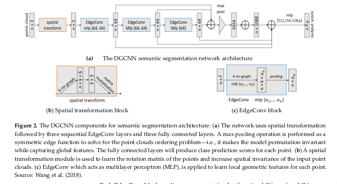

# FugroDGCNN
A package containing functionality for training and inference using the *Dynamic Graph Convolutional Neural Net* (DGCNN) architecture.
Based off the *AHN3-dgcnn.pytorch* package. 

<p align="center">
    
</p>
<p align="center">
    DGCNN Architecture
</p>
<p align = "center">
    Obtained from *Widyaningrum, E.; Bai, Q.; Fajari, M.K.; Lindenbergh, R.C. Airborne Laser Scanning Point Cloud Classification Using the DGCNNDeep Learning Method. Remote Sens.2021, 13, 859. https://doi.org/10.3390/rs13050859*
</p>

## Data

### Pre-Processing
Data for this model is extracted from point clouds in either *LAS* or *HDF5* formats, and the functionality for processing these sources is mostly in *./prepare_data*
To load in a set of pointclouds from a directory `pointcloud_dir`, process them, and then save the processed pointclouds to another directory `out_dir`, the `load_pointcloud_dir` function can be used. 

Due to memory constraints, point clouds are split into tiles, and then randomly subsampled and split into smaller tiles. For example, the code below loads pointclouds from `some_dir`, relabels the classifications according to the mapping given in `map_file`, splits them each into 5 100mx100m blocks and generates AGL for each block. For a tile to be processed, it must contain at least 100 points of each class. Then, each block is randomly split into a set of 10 30mx30m "sub blocks", and randomly subsampled to 7000 points. These are stored in text files in `output_dir`.

```python
pointcloud_dir = "some_dir" # where to get the original data
out_dir = "output_dir" # where to put the processed blocks
block_size = 100 # "big" block size
sub_block_size = 30 # "sub" block size
min_num = 100 # must have this many points per class to be added to set
class_map_file = "map_file"
calc_agl = True # indicates that we want AGL
sample_num = 5 # how many big blocks to divide into
sub_sample_num = 10 # how many sub blocks to divide into

data_batches, data_labels = load_pointcloud_dir(
                                        pointcloud_dir,
                                        out_dir,
                                        block_size = block_size,
                                        sample_num = sample_num,
                                        class_map_file = class_map_file,
                                        min_num = min_num,
                                        calc_agl = calc_agl,
                                        sub_block_size = sub_block_size,
                                        sub_sample_num = sub_sample_num
                                                )
```

### File Systems
For the model to have access to a dataset, it is necessary to format the data directory appropriately. Data stored in a "Datasets" directory should be stored as below. Here *Pointcloud_dir* contains the raw pointclouds, *Area* contains the "annotated" pointcloud data separated into tiles and sorted further into text files containing the points corresponding to each class label in that tile. The content in this directory is produced by the `extract_annotations` function in `process_data.py`. The directory `data_NPY` contains the data put into *.npy* files, which are passed into data loaders and fed as arrays into the function during training/inference.

```bash
Datasets
|--Pointcloud_dir
|--Area
|----data_folder
|------raw pointcloud data in *.txt* format
|----processed_data_folder
|------Area_n
|--------Area
|----------Area_n.txt (contains all data for this block)
|----------Annotations
|------------Separate text files for points corresponding to each class in this block
|--data_NPY
|----All *.npy* data files used directly in training
```

The data loaders in this package use files in *.npy* format, so the `data_batches` and `data_labels` have to be converted into this form. 

## Model Interface
The *DGCNN* model is implemented using *PyTorch* by the `DGCNN` class in `model.py`. The architecture mostly follows the above figure (save for some differences in the weight dimensions. To define a model, specify the number of classes `num_classes`, number of point features `num_features` (e.g. x, y, z, agl), the number of nearest neighbours `k` to compute in the *EdgeConv* layers, the "embedding dimensions' `emb_dims` which is the dimension the model projects global and local features into at some stage in inference, and `cuda` which indicates whether or not to use `CUDA` capabilities in model inference. 
```python
num_classes = 5
num_features = 4
k = 30
emb_dims = 1024
cuda = False
dgcnn = DGCNN(num_classes, num_features, k, dropout = dropout, emb_dims = emb_dims, cuda = cuda)
```

To directly get a prediction from the model given an `BxFxN` tensor of points (`B` is the batch size, `F` is the number of features and `N` is the number of points), one can pass the matrix directly into the model class.

```python
N = 1000
B = 1
F = 4
data = torch.rand(B, F, N)
logits = model(data)
probs = torch.nn.functional.softmax(logits, dim = 1)
probs.permute(0, 2, 1).contiguous()
predictions = logits.max(dim = 2)[1]
```

Training can be performed using the `train` function in `train.py`, which has a selection of configurable hyperparameters, directory locations and logging options. 
As a simple example, one may specify the model parameters above, as well as the location of a dataset given as a set of *numpy* *.npy* files, specify the number of classes, number of points per block to sample, the number of epochs to train for, and the training and validation batch sizes, as given below. Also requirted is an `IOStream` where all logging data is streamed to.
```python
num_classes = 5
num_features = 4
data_dir = "path/to/npy_data/"
num_points = 7000
epochs = 30
k = 30
log_file = "path/to/my/logfile.log"
io = IOStream(log_file)
train_batch_size = validation_batch_size = 8
train(k, io, 
        data_dir = data_dir, 
        num_points = num_points, 
        epochs = epochs,
        num_classes = num_classes,
        num_features = num_features,
        train_batch_size = train_batch_size,
        validation_batch_size = validation_batch_size)
```

Inference on a data set stored in the *numpy* can be performed using the `test` function in `test.py`. Similarly to `train`, this can be called by specifying a data location, model and sampling parameters, etc.

To perform inference on a particular point cloud (that is locally stored either in HDF5 or LAS format), you can use the `predict` function as follows:

```python
k = 30
io = IOStream("path/to/logfile.log")
pointcloud_file = "mypointcloud.las"
pred_pointcloud_file = "myclassifiedpointcloud.las"
num_points = 7000
block_size = 30.0
num_classes = 5
num_features = 4
min_class_confidence = 0.8 # lower bound on probability for classifications- if below, leave unclassified
data, preds = predict(k, io, 
                        pointcloud_file, 
                        pred_pointcloud_file,
                        num_points = num_points,
                        block_size = block_size,
                        num_classes = num_classes,
                        num_features = num_features,
                        min_class_confidence = min_class_confidence)
```

The main execution can be done using the file `main.py`. Here you can firstly specify whether you want to process data or train/test a model. Arguments are passed via the command line (see `main.py`for details). As an example, training can be run by executing:

```bash
python3 main.py \
--mode classifier \
--eval 0 \
--batch_size 4 \
--validation_batch_size 4 \
--epochs 100 \
--k 40 \
--model_label my_dgcnn_model_name  \
--num_classes 4 \
--validation_prop 0.2  \
--num_features 4 \
--data_dir /path/to/my/npy/data \
--min_class_num 20 \
--num_points 7000
```